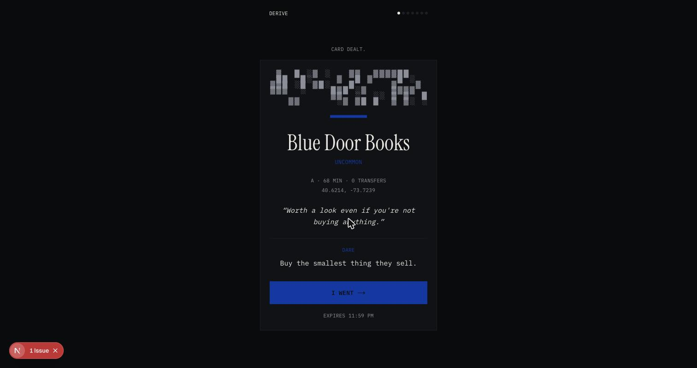
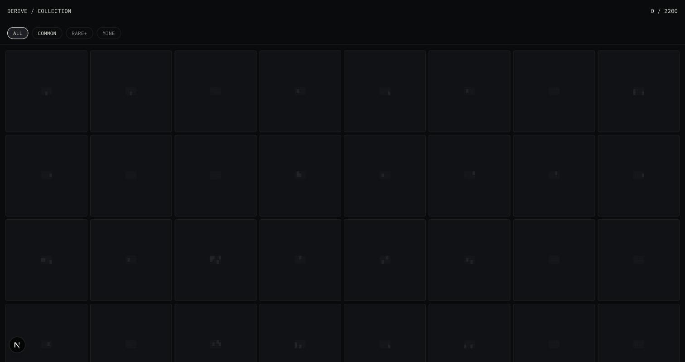

# DERIVE

One spin a day. Enter a NYC address or ZIP, and DERIVE deals you a card: a
real place in New York, reachable from where you are by subway, with a
dare attached. No rerolls. You either go, or the card expires at midnight
and your streak dies.

It's a loot box for the city. Rarity is distance and obscurity — a Common
is a bodega six blocks away, a Legendary is the last stop on the A train
at sunrise.

| Card dealt | Collection grid |
|---|---|
|  |  |

## Quickstart

No accounts, no API keys, no external services to sign up for. The seed
data (2,200 real NYC places, the full subway travel-time matrix, and card
copy for every place) is committed to the repo.

```bash
pnpm install
pnpm dev
```

Open `http://localhost:3000`, type a NYC address or ZIP (try a Rockaway
one for a shot at Legendary), and spin.

## How it works

- **The spin.** One per day, keyed to your local midnight. The card is
  server-seeded from a hash of your (anonymous, localStorage-only) user
  id and the date, so refreshing the page can never reroll it — the same
  inputs always produce the same card.
- **Rarity is derived, not assigned.** Every place's rarity score is a
  weighted function of travel time, how sparsely it's tagged on
  OpenStreetMap, and how far it sits from the city's tourist-attraction
  centroid — computed fresh against whatever pool your filters leave
  standing. A five-tag bodega six stops from a tourist cluster reads as
  more "Common" than a two-tag stoop in the Rockaways, without either one
  being hand-labeled. See `CONTRACT.md` and `src/lib/rarity.ts` for the
  exact algorithm, and `src/lib/schemas.ts` for the tunable tier weights
  (55 / 27 / 13 / 4.5 / 0.5%).
- **The dare.** Every card carries one instruction that turns the trip
  into a story — generated in a nightly batch job, cached in SQLite,
  never a live model call on spin. Ships with zero required API keys: a
  template-based fallback generator (varied by category, deterministic
  per place) produces the copy for the committed dataset. Set
  `ANTHROPIC_API_KEY` and run `pnpm generate:cards` to regenerate with a
  live model instead.
- **Proof.** Photo + GPS check against the target (150m radius — GPS in
  Manhattan is a mess between buildings), or an honor-system "I went" for
  anyone who'd rather not hand over a photo. Both mint the card into your
  collection; honor completions render with a dotted border instead of a
  solid one, visibly different, never hidden.
- **Filters actually filter.** Max travel time, boroughs, categories,
  rarity floor, open-now (with an honest "hours unknown" state), budget,
  indoors, step-free stations (MTA elevator/escalator data), time of day.
  Every one of these becomes a real SQL predicate before the roll, not a
  post-hoc `.filter()` — see `src/lib/query-builder.ts`.

## The data

| Source | What | Where |
|---|---|---|
| OpenStreetMap (Overpass API) | 2,200 quality-filtered places across all 5 boroughs | `data/osm/places.json`, `scripts/ingest-places.ts` |
| MTA GTFS static feed | ~496 station complexes, 112,785-pair travel-time matrix | `data/gtfs/station-matrix.json`, `scripts/build-station-matrix.ts` |
| Nominatim | Live geocoding of your address/ZIP at spin time | `src/lib/geocode.ts` |

Place breakdown in the committed snapshot:

- **Boroughs:** Brooklyn 722 · Staten Island 551 · Queens 524 · Manhattan 342 · Bronx 61
- **Categories:** shop 357 · transit-oddity 322 · weird 331 · food 299 · historic 207 · park 200 · water 170 · drink 138 · art 152 · viewpoint 24

Deliberately includes far-out, low-density neighborhoods (Rockaway, City
Island, Broad Channel, Tottenville) so Legendary tier has real material,
not just the High Line with a bigger dither field.

Re-running the pipeline (`pnpm ingest:gtfs && pnpm ingest:places && pnpm generate:cards`)
is documented in `scripts/README.md` — everything is a repeatable script
against live public data, no scraping credentials needed.

## Design

Dark ground, transit-terminal register. The accent system is the **MTA
line colors** — every card is tinted by the line that gets you there,
never a single global brand color. Rarity renders as **ASCII dither
density**: a Common card's field is sparse `░`, a Legendary's is a dense
`▓▓▓` block that resolves on reveal. No glow, no gradients, no loot-beam
VFX — see `CONTRACT.md` for the full token system and ASCII wireframes.

## Stack

Next.js App Router (TypeScript strict), SQLite via `better-sqlite3` +
Drizzle, Zod at every boundary, Tailwind v4. No serverless-only
dependencies — this is meant to run on a Raspberry Pi in a dorm room.

```bash
pnpm test        # rarity distribution (100k rolls), timezone-boundary logic, query builder
pnpm lint
pnpm build
```

## License

MIT — see `LICENSE`.

## Contributing

See `CONTRIBUTING.md`.
